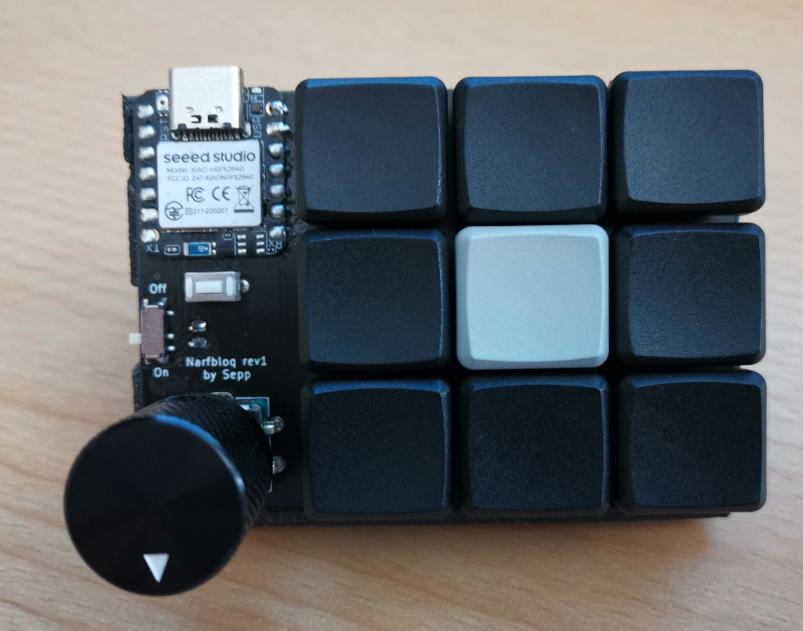
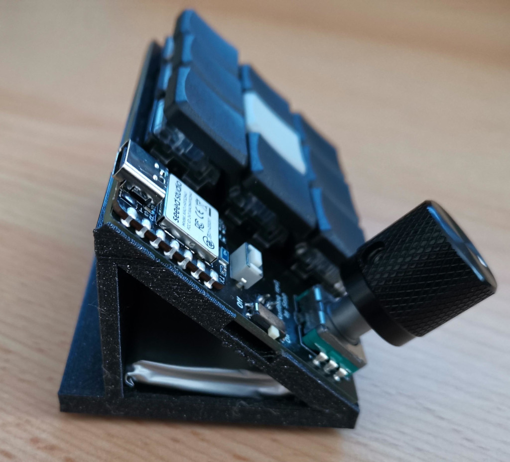

# narfbloq

A wireless version of the narfpad.

## BOM

- narfpad PCB
- 1 Seeed Studio XIAO nRF52840
- 10 SOD123 diodes
- 9 Kailh Choc Hotswap Sockets
- 9 Choc Switches (and keycaps)
- 1 EC11 Encoder
- 1 Reset Button (optional but recommended since the one on the MCU is really tiny)
- 1 MSK-12C02 Switch
- 1 JST-PH 2mm connector
- 1 3.7V LiPo battery with JST-PH 2mm connector (I designed this for a 30x40x6.5 battery which fits the case nicely)
- 1 3D printed case (I scaled it to 102% and the PCB fits it quite nicely at that size)

## Firmware

Firmware available here:

https://github.com/sebastian-stumpf/zmk-config-narfbloq
